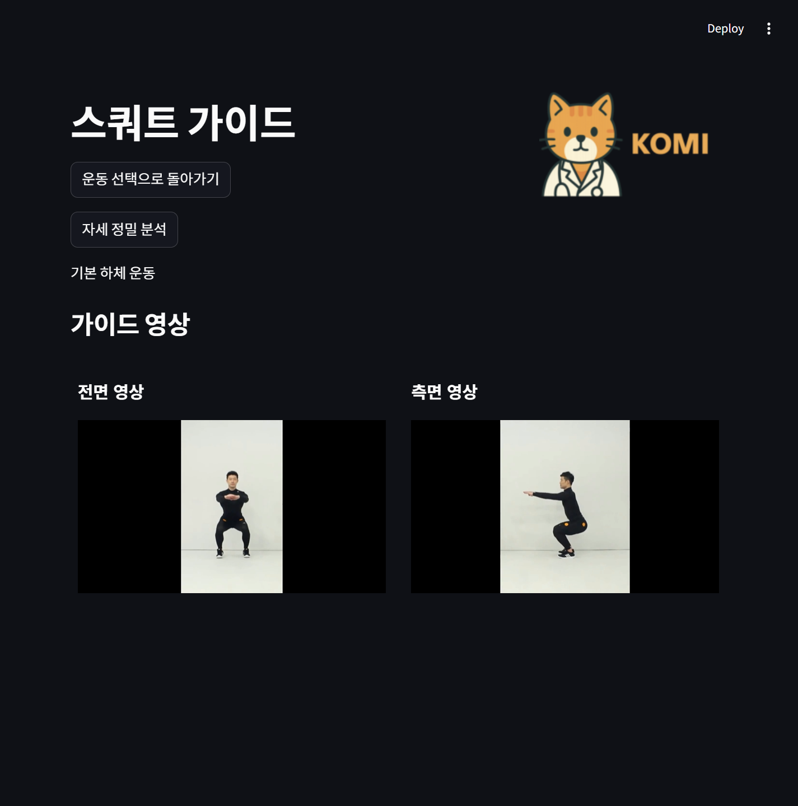
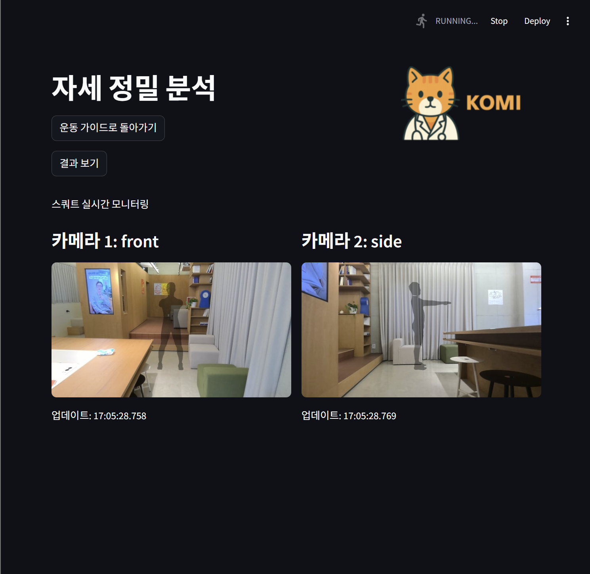
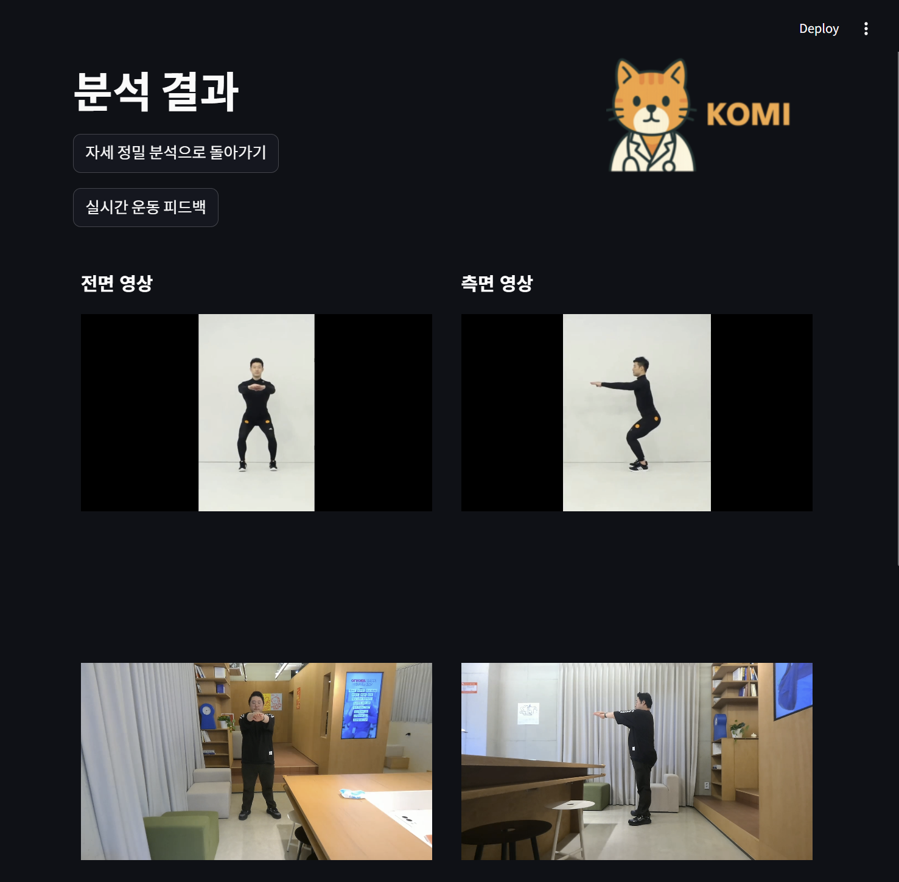
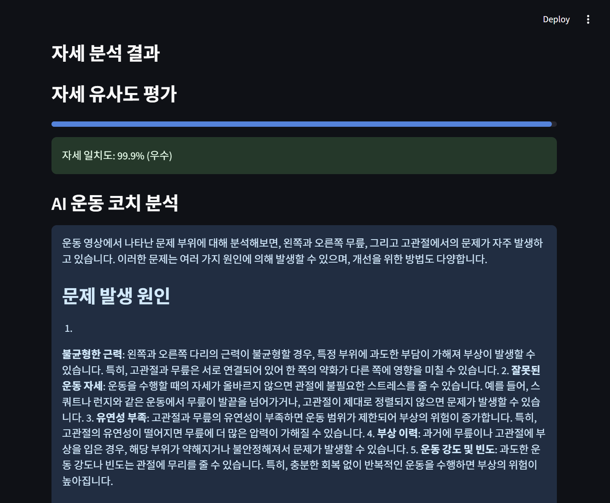
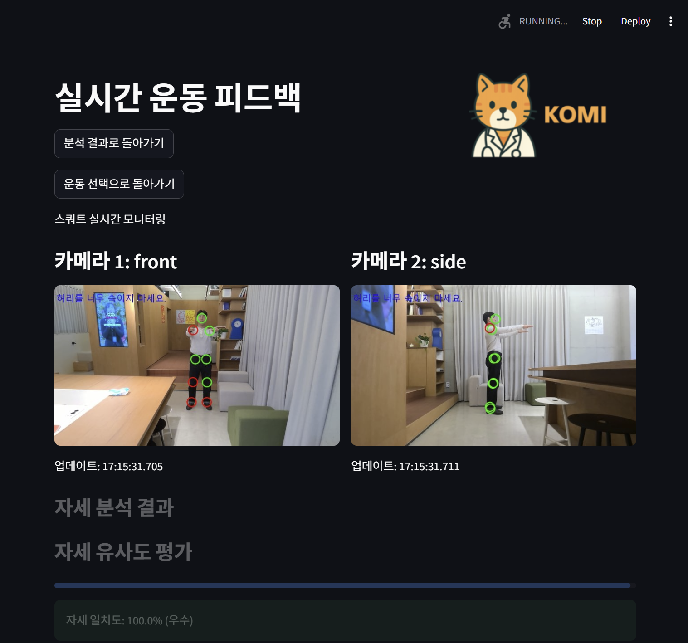

# KOMI_PJT
KOMI : Kinematic Optimization & Motion Intelligence

<a href = "https://www.canva.com/design/DAGiKMgcty0/BKc66c8gNKqbPAuz8I96HA/edit?utm_content=DAGiKMgcty0&utm_campaign=designshare&utm_medium=link2&utm_source=sharebutton"> 최종발표 자료
</a>

## 프로젝트 개요
KOMI는 AI 기반 실시간 관절 분석 및 LLM을 활용한 원격 진단·맞춤형 재활 운동 추천 시스템입니다. 사용자가 운동 영상을 보고 따라 하면 웹캠을 통해 자세를 분석하고 실시간 피드백을 제공합니다.

## 주요 기능
- **실시간 자세 분석**: YOLO11 기반 포즈 감지로 사용자의 자세를 실시간 분석
- **다중 시점 분석**: 전면/측면 2대의 카메라를 동기화하여 정확한 자세 분석
- **LLM 기반 피드백**: 개인화된 자세 교정 조언 및 재활 운동 추천
- **직관적인 UI**: 운동 가이드부터 분석 결과까지 사용자 친화적 인터페이스

## 기술 스택
- **CV**:  YOLO11, Pose Detection, Segmentation
- **LLM**: ChromaDB, RAG, LangChain
- **Server**: FastAPI, WebSocket, Streamlit

## 사용자 시나리오

### 1. 운동 가이드
1. 운동 선택 페이지에서 적합한 운동 선택
2. 운동 가이드 페이지에서 전면/측면 영상 학습
3. 자세 정밀 분석 페이지로 이동하여 카메라 활성화
4. 'mask' 모드에서 올바른 자세 확인 후 영상 녹화
5. 분석 결과 페이지에서 자세 유사도 점수 및 LLM 피드백 확인
6. 실시간 운동 피드백 페이지에서 지속적인 자세 교정 진행

### 2. 실시간 자세 교정
1. 원하는 운동 선택 후 실시간 운동 피드백 페이지로 이동
2. 'detect' 모드에서 카메라 활성화
3. 실시간으로 자세를 취하면 정확도 및 문제점 즉시 표시
4. 키포인트 기반 시각적 피드백과 교정 지침 확인
5. 지속적인 자세 교정 및 개선 유도

## 서비스 스크린샷

### 운동 선택 화면


### 운동 가이드 화면


### 정밀 분석 화면


### 분석 결과 화면



### 실시간 자세 분석 화면


## 운동 분석 파이프라인

### 정밀 분석 흐름
1. 웹캠 클라이언트에서 운동 영상 녹화
2. 녹화 완료 후 서버에 영상 업로드
3. 서버에서 영상 프레임 추출 및 일괄 처리
4. 프레임별 포즈 감지 및 키포인트 추출
5. 기준 운동과의 각도 기반 유사도 측정
6. L2 거리, 코사인 유사도 계산을 통한 정확도 평가
7. LLM을 활용한 자세 교정 피드백 생성
8. 결과를 JSON 형태로 저장 및 UI에 표시

### 실시간 분석 흐름
1. 웹캠 클라이언트에서 2개 방향(전면/측면) 영상 캡처
2. Base64 인코딩 후 WebSocket을 통해 서버로 전송
3. 서버에서 YOLO11 모델을 통한 포즈 감지 수행
4. 관절 좌표 추출 및 참조 포즈와 실시간 비교
5. 정확도 점수 계산 및 문제점 식별
6. WebSocket을 통해 결과 전송
7. Streamlit UI에서 즉각적 피드백 표시

## 설치 및 실행 방법
```bash
# 1. 저장소 클론
git clone https://github.com/LJH0963/KOMI_PJT.git
cd KOMI_PJT/komi_service/

# 2. 필요 패키지 설치
pip install -r requirements.txt

# 3. FastAPI 서버 실행
uvicorn fastapi_server:app --host 0.0.0.0 --port 8000

# 4. 웹캠 클라이언트 실행 (별도 터미널에서)
python webcam_client.py --cameras front:0 side:1 --server "http://localhost:8000"

# 5. Streamlit 앱 실행 (별도 터미널에서)
streamlit run streamlit_app.py
```

자세한 기술 문서는 [komi_service/README.md](komi_service/README.md)를 참조하세요.

### git clone
```
$ git clone https://github.com/LJH0963/KOMI_PJT.git
```

### 자주쓰는 git 명령어

```
$ git log  # commit 내역 확인
```
```
$ git status  # 현재 파일 변경 상태 확인
```
```
$ git diff  # 파일 변경 내용 확인
```
```
$ git restore [파일경로]
  # 특정 파일의 수정 내용을 마지막 커밋으로 되돌리기
  # ex. git restore notebooks/eda_ikh.ipynb
  # (주의) 수정한 내용이 사라집니다
```
```
$ git branch
$ git checkout
$ git merge
```

### 서버에서 작업할 때
```
$ git -c user.name="YourName" -c user.email="YourEmail@example.com" add .  
$ git -c user.name="YourName" -c user.email="YourEmail@example.com" commit -m "커밋 메시지"  
$ git -c user.name="YourName" -c user.email="YourEmail@example.com" push
```
